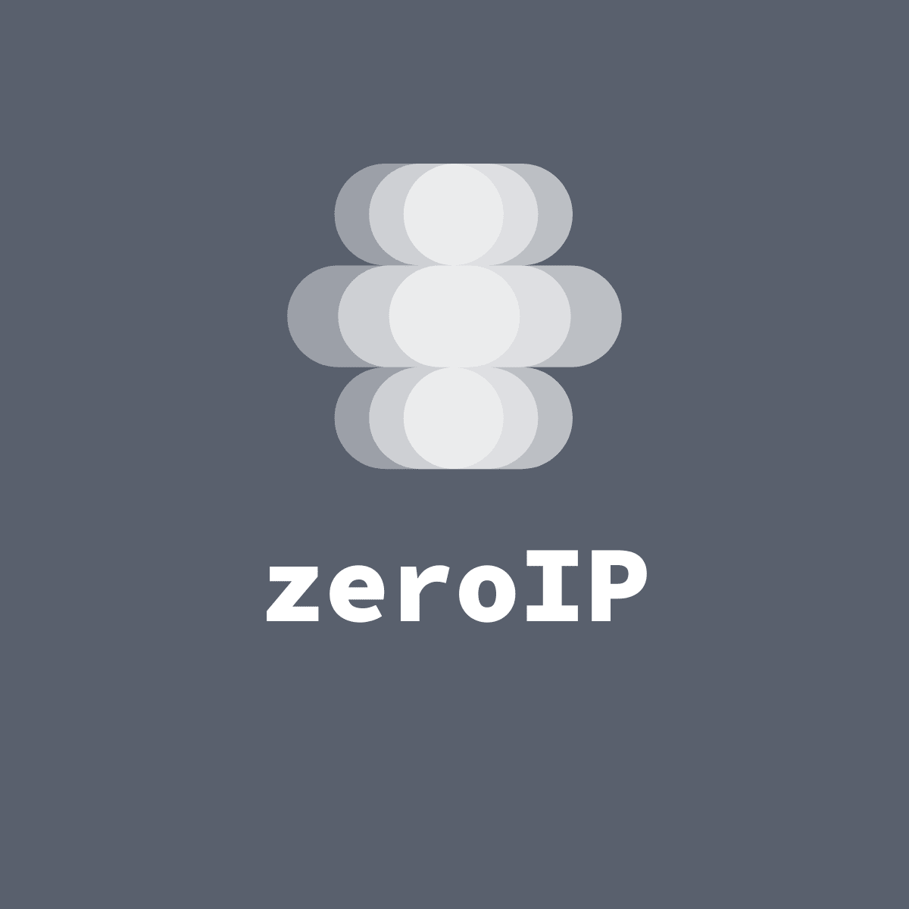
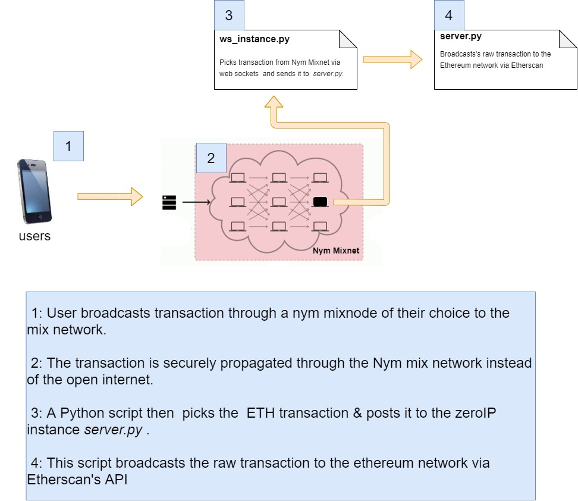

<p align="center">
  <a href="https://github.com/as1ndu/zeroIP">
    
  </a>

  <h1 align="center">ZeroIP (proof of concept)</h1>

  <p align="center">
     Anonymously broadcast crypto transactions without revealing your IP address.
    <br />
    <a href="https://speakerdeck.com/as1ndu/zeroip"><strong>Slides »</strong></a>
    <br />
    <br />
    <a href="https://github.com/as1ndu/zeroIP/issues">Issues</a>
    ·
    <a href="https://gitcoin.co/hackathon/privacy">About Protect Privacy</a>
  </p>
</p>

## Problem statement

A cryptocurrency transaction is broadcast by a user sending a signed message to
several nodes that propagate it through the network via the mempool  —  until a miner
includes it in a block.

This propagation of the transaction is often done via the open internet. As a
side effect, users simultaneously leak their IP addresses, & this makes  it possible to decode
metadata such as physical location, timezone etc for both the sender, recipients, miners
& node operators.

Even if the users are transacting in  privacy currencies like Zcash, Monero, Grin or
using tumblers, the problem still persists.
This is because the IP address leakage problem exists in the networking layer of the app
and not the blockchain's data layer.
Users can be tracked by analyzing IP addresses of  transaction broadcasts on the open internet as elaborated by several researchers[^1]

## Solution Over view



zeroIP is an api interface that allows cryptocurrency transactions to be sent to miners
without leaking  IP addresses.

It achieves this by proxing transactions through the Nym Anonymity Mixnet[^2].
The Nym mixnet propagates data packets in a provably secure cryptographic format called Sphinx.
The Sphinx format encrypts packet size/length, packet origin & packet destination[^3].

This allows node operators, miners  & wallet users to securely propagate transactions amongst
each other without revealing metadata like physical location, timezone etc.
zeroIP inherently acts as a proxy server or VPN service for crypto payments.

## Usage

zeroIP can be used in two ways.

1. Broadcast packet via web sockets

```javascript
// Easy dependency free integration with wallets

// Create data structure to send sphinx packet
const sendMsg = JSON.stringify({
  type: "send",
  message: "ETH transaction payload",
  recipient_address: "ZeroIp-mix-client-address",
});

// Connect to the any mix node
const conn = new WebSocket(`ws://nym-mix-node:9001/mix`);
conn.onmessage = (ev: MessageEvent): void => {
  const receivedData = JSON.parse(ev.data);
  if (receivedData.type == "send") {
    console.log("sent transaction.");  // know if the transaction has been sent
  }  
}

// Securely sphinx packet via Web sockets channel
conn.send(sendMsg);
```

The second way is by hosting an simple web interface where users can broadcast transactions by pasting the transaction
payload in to a form (similar to Ether Scan's [pushTx](https://etherscan.io/pushTx)).

### Footnotes

[^1]: [An Analysis of Anonymity in Bitcoin Using P2PNetwork Traffic](https://www.freehaven.net/anonbib/cache/bitcoin-p2p-anon.pdf), [Transaction Clustering Using Network Traffic Analysis for Bitcoin and Derived Blockchains](https://orbilu.uni.lu/bitstream/10993/39728/1/biryukov-tikhomirov-transaction-clustering.pdf)

[^2]: [The Nym Mixnet](https://nymtech.net/)

[^3]: [Sphinx: The anonymous data format behind Lightning and Nym](https://medium.com/nymtech/sphinx-tl-dr-the-data-packet-that-can-anonymize-bitcoin-and-the-internet-18d152c6e4dc)
